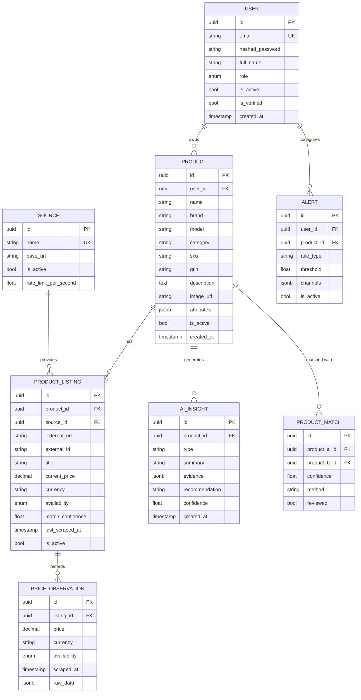

# Database Design — PriceLoop

## ER Diagram (Mermaid)

## Core Tables (Current Implementation)

### users
- Authentication & RBAC (USER / ANALYST / ADMIN)

### products
- Canonical product the user wants to track

### sources
- Supported e-commerce sources (amazon, flipkart, demo, …)

### product_listings
- Concrete URL / listing on a source linked to a product

### price_observations
- Time-series price + availability snapshots

## Future Tables (planned)

- scrape_jobs / scrape_results
- product_matches
- alerts / alert_events
- ai_insights
- notifications
- cost_records
- audit_logs

## Notes

- `price_observations` will later be partitioned by time for performance.
- `pgvector` extension is available for embedding-based product matching.
- All monetary values use `Numeric(12, 2)`.
- Timestamps are timezone-aware (UTC).
